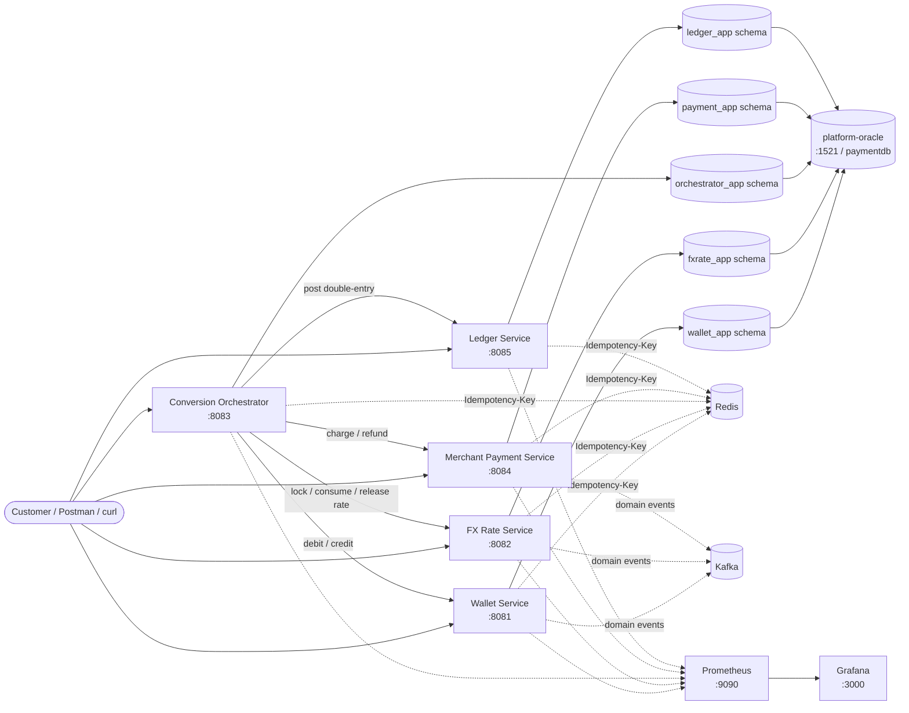
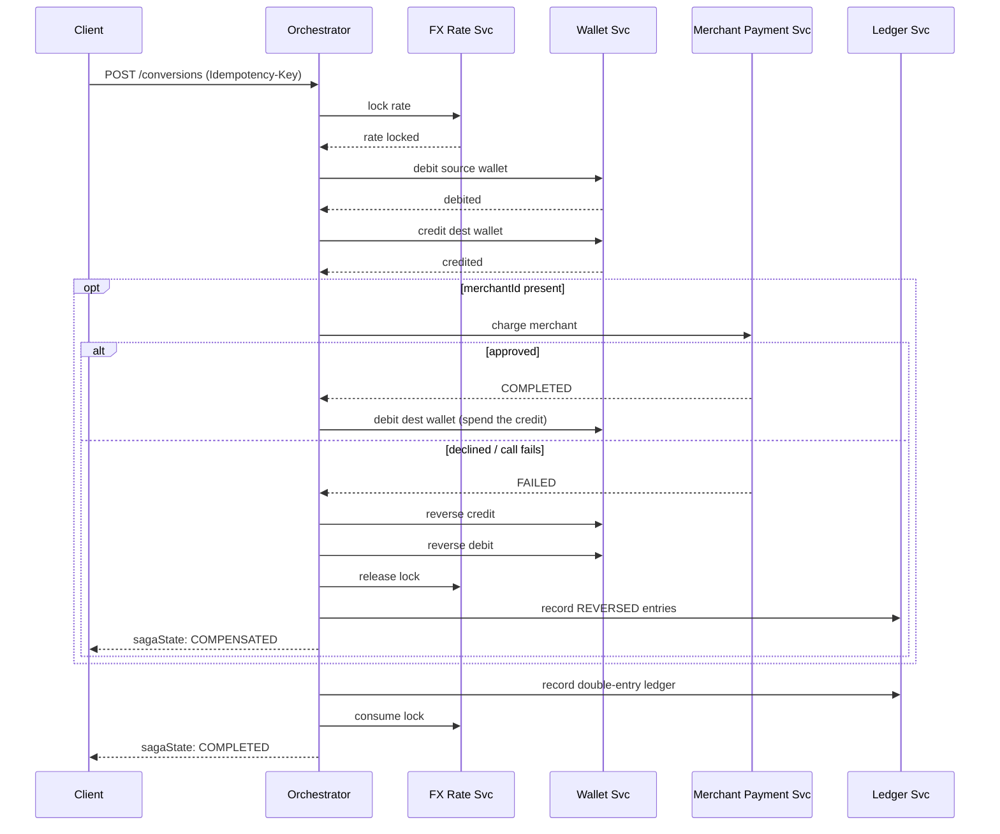

# Distributed Payment Platform

A distributed, multi-currency wallet, FX conversion, and merchant-payment platform built as five
independent Spring Boot microservices, coordinated by an orchestration-based SAGA. Built as a
from-scratch learning/portfolio project: real concurrency control (optimistic + pessimistic
locking), real idempotency (Redis `SETNX`), real compensating transactions, real observability
(Prometheus + Grafana) — verified against real Oracle/Redis/Kafka, not mocked end to end.

Full design rationale lives in
[`documents/Multi-Currency-Wallet-FX-Platform-Design-Document.md`](documents/Multi-Currency-Wallet-FX-Platform-Design-Document.md);
every implementation decision — including every deliberate deviation from that design doc, and
why — is written up in [`backend-documents/`](backend-documents) (see the Documentation Map
below).

## Architecture



Each service owns its own Oracle schema (schema-per-service, in one shared Oracle instance) and is independently
deployable and testable; the orchestrator is the only service that calls the other four. Redis
and Kafka are shared infrastructure. Full rationale for this shape (and why a SAGA instead of a
single ACID transaction) is in the design doc's §3.3.

## Services

| Service | Port | Owns (Oracle schema) | Responsibility |
|---|---|---|---|
| [wallet-service](backend/wallet-service) | `8081` | `wallet_app` | Multi-currency wallet balances, reservations, optimistic/pessimistic concurrency control |
| [fx-rate-service](backend/fx-rate-service) | `8082` | `fxrate_app` | Current FX rates (simulated feed), short-lived rate locks for a conversion |
| [conversion-orchestrator](backend/conversion-orchestrator) | `8083` | `orchestrator_app` | Drives the wallet-to-wallet-conversion-plus-optional-merchant-charge SAGA and its compensation |
| [merchant-payment-service](backend/merchant-payment-service) | `8084` | `payment_app` | Charges/refunds via a mock acquirer |
| [ledger-service](backend/ledger-service) | `8085` | `ledger_app` | Immutable double-entry ledger, posted by the orchestrator on every completed or compensated conversion |

All five schemas live in one shared `platform-oracle` instance (`paymentdb` PDB, host port `1521`); each service connects as its own user.

Plus shared infrastructure: one Oracle Database Free 23ai instance (a schema per service), Redis (idempotency keys), Kafka
(domain events), Prometheus + Grafana (metrics).

## The SAGA (conversion, optionally followed by a merchant charge)



Every state transition is persisted before the next step runs, so `conversion_transaction` and
`saga_step_log` always reflect exactly how far a saga got — including a full compensation path
if a debit, credit, or merchant charge fails partway through. See
[`conversion-orchestrator-implementation.md`](backend-documents/conversion-orchestrator-implementation.md)
for every real bug this surfaced and how each was fixed.

## Concurrency, resilience, and correctness patterns actually built

| Pattern | Where | Doc |
|---|---|---|
| Optimistic locking + bounded retry, pessimistic locking for hot wallets | wallet-service | [wallet-service-implementation.md](backend-documents/wallet-service-implementation.md) |
| Redis `SETNX`-backed Idempotency-Key, one independent copy per service | all 5 services | [idempotency.md](backend-documents/idempotency.md) |
| Compensating transactions (full SAGA rollback) | conversion-orchestrator | [conversion-orchestrator-implementation.md](backend-documents/conversion-orchestrator-implementation.md) |
| Kafka domain-event publishing (producer-only, no consumer yet) | wallet/fx-rate/merchant-payment | [kafka-events.md](backend-documents/kafka-events.md) |
| Immutable double-entry ledger, synthetic FX clearing account for cross-currency netting | ledger-service | [ledger-service-implementation.md](backend-documents/ledger-service-implementation.md) |
| Prometheus + Grafana, incl. 3 hand-instrumented metrics answering this platform's own concurrency questions | all 5 services | [observability.md](backend-documents/observability.md) |
| Flyway-versioned schema migrations (replacing `ddl-auto=update`) | all 5 services | each service's implementation notes' "Schema notes" |
| Testcontainers integration tests against a real, Flyway-migrated Oracle | all 5 services | [testing-guide.md](backend-documents/testing-guide.md)'s Pattern 6 |

## Tech stack

Java 25, Spring Boot 4.1.1 (Web MVC, Data JPA, Validation, Actuator), Jackson 3, Oracle Database Free 23ai,
Flyway, Redis 7, Apache Kafka 3.9 (KRaft mode), Prometheus + Grafana, Docker + Docker Compose,
Maven, JUnit 5 + Mockito + AssertJ.

## How to run it locally

Requires Docker (and Java 25 only for the "run on the host" option below — each service's own
bundled `./mvnw` handles Maven itself).

### Option A: one command, everything containerized

```bash
cd backend
docker compose up -d --build
```

Brings up the shared `platform-oracle` instance, Redis, Kafka, Prometheus, Grafana, and all 5
application services (each with its own `Dockerfile`), fully networked — `docker-compose.yml`'s
`depends_on: condition: service_healthy` means an app container won't even attempt to start
before Oracle is actually ready. First run builds all 5 images (a couple of minutes);
`gvenzl/oracle-free:23-slim` is a ~1 GB image and the instance takes **~2–4 min** to become
healthy on first boot (create PDB → run `backend/oracle-init/` to create the per-service users →
open); after that it's fast. Re-run `docker compose up -d` once it's healthy if the app services
gave up waiting the first time. `--build` is needed after **any** `pom.xml` or `src/` change —
plain `docker compose up -d` reuses the stale image (which will still have the old JDBC driver;
see [oracle-migration.md](backend-documents/oracle-migration.md) Issue 6).

> One shared Oracle instance, not one per service: 5 `gvenzl/oracle-free` containers need
> ~8–10 GB RAM and OOM Docker Desktop (which then wedges the whole engine — needs a Docker
> Desktop restart, not just a retry). Give Docker Desktop ≥ 8 GB. See
> [oracle-migration.md](backend-documents/oracle-migration.md) Issue 0.

#### Day-to-day stop / start

Once the stack has been built and started once, the everyday cycle is (from `backend/`):

```bash
docker compose stop        # stop all containers - keeps them, the data volume, and the Oracle schemas
docker compose up -d        # start again - fast (no rebuild, no re-init), Oracle back in ~30s
```

Use `docker compose up -d` to restart, **not** `docker compose start` — only `up -d` re-applies
the `depends_on: condition: service_healthy` gating, so the app services wait for Oracle instead
of racing it and crashing.

| Goal | Command (from `backend/`) |
|---|---|
| Status of all containers | `docker compose ps` |
| Follow one service's logs | `docker compose logs -f wallet-service` |
| Restart just one service | `docker compose restart wallet-service` |
| After any `pom.xml` / `src/` change | `docker compose up -d --build` |
| Stop and remove containers, **keep** DB data | `docker compose down` |
| Stop and **wipe** DB data (next `up` re-runs `oracle-init/`) | `docker compose down -v` |

To have the containers come back automatically after a laptop reboot or a Docker Desktop
restart, add `restart: unless-stopped` under each service in `docker-compose.yml` — `docker
compose stop` still stops them and keeps them stopped; every other interruption self-recovers.

DB connection details for every schema (users, passwords, JDBC URLs, `sqlplus` one-liners) are
in [oracle-migration.md](backend-documents/oracle-migration.md) → "Connection details".

### Option B: infrastructure in Docker, services on the host

Useful for iterating on one service without rebuilding its image every time.

```bash
cd backend
docker compose up -d platform-oracle redis kafka prometheus grafana

cd wallet-service              && ./mvnw spring-boot:run   # :8081
cd fx-rate-service              && ./mvnw spring-boot:run   # :8082
cd merchant-payment-service     && ./mvnw spring-boot:run   # :8084
cd ledger-service               && ./mvnw spring-boot:run   # :8085
cd conversion-orchestrator      && ./mvnw spring-boot:run   # :8083 (start last - calls the other four)
```

Don't mix the two for the same service (both bind the same host port). Everything downstream —
Prometheus, Grafana, and every `curl` example below — works identically either way: all 5
services always end up reachable at `localhost:8081`–`8085` and scraped the same way, since the
containerized services also publish their ports to the host (see `docker-compose.yml`'s comments
on the `kafka` and `prometheus` services for exactly how host-vs-container networking is kept
working both ways at once — including Kafka's two listeners, one per mode).

- Prometheus targets: http://localhost:9090/targets (all 5 should show `UP`)
- Grafana dashboard: http://localhost:3000 (anonymous viewer works; `admin`/`admin` to edit) →
  "Distributed Payment Platform - Overview"

All 5 services share one Oracle instance on host port `1521` (`paymentdb` PDB), each connecting
as its own user; see each service's implementation notes for its schema and any service-specific
setup.

## Try it

```bash
# Create two wallets
curl -X POST http://localhost:8081/api/v1/wallets -H "Idempotency-Key: k1" \
  -H "Content-Type: application/json" \
  -d '{"userId":"user-1","currency":"USD","highContention":false}'

curl -X POST http://localhost:8081/api/v1/wallets -H "Idempotency-Key: k2" \
  -H "Content-Type: application/json" \
  -d '{"userId":"user-2","currency":"INR","highContention":false}'

# Fund the source wallet (use the walletId from the response above)
curl -X POST http://localhost:8081/api/v1/wallets/{sourceWalletId}/credit \
  -H "Idempotency-Key: k3" -H "Content-Type: application/json" \
  -d '{"amount":100.00,"transactionId":"fund-1"}'

# Run a conversion through the orchestrator
curl -X POST http://localhost:8083/api/v1/conversions -H "Idempotency-Key: k4" \
  -H "Content-Type: application/json" \
  -d '{"userId":"user-1","sourceWalletId":"{sourceWalletId}","destWalletId":"{destWalletId}","sourceCurrency":"USD","destCurrency":"INR","sourceAmount":50.00}'

# See the resulting double-entry ledger
curl http://localhost:8085/api/v1/ledger/wallets/{sourceWalletId}/statement
```

Each service's `backend-documents/<service>-api/` folder has a full OpenAPI spec, a Postman
collection, and one markdown doc per endpoint with sample requests/responses and error tables.
[`backend-documents/distributed-payment-platform.postman_collection.json`](backend-documents/distributed-payment-platform.postman_collection.json)
bundles all five services (one folder each, 22 requests) into a single importable collection.

## Testing

236 automated tests across the 5 services — unit tests (Mockito-mocked collaborators) for
business logic, plus one Testcontainers integration test class per service (real Oracle
Database Free 23ai, Flyway-migrated) for the persistence layer — see
[testing-guide.md](backend-documents/testing-guide.md) for the full scope decision and reusable
test patterns. Plus extensive manual `curl` verification against real Oracle/Redis/Kafka for
every scenario, documented in each service's own implementation notes.

```bash
cd backend/<service> && ./mvnw test   # the Oracle integration tests need Docker running locally (pulls gvenzl/oracle-free)
```

## Documentation map

- [`documents/Multi-Currency-Wallet-FX-Platform-Design-Document.md`](documents/Multi-Currency-Wallet-FX-Platform-Design-Document.md) — the original design doc.
- `backend-documents/<service>-implementation.md` — what was built, what's deliberately deferred (and why), real bugs caught and how, schema notes, how to run, manual verification performed.
- `backend-documents/<service>-api/` — OpenAPI spec, Postman collection, per-endpoint docs.
- `backend-documents/idempotency.md`, `kafka-events.md`, `observability.md` — cross-cutting concept docs (what/why/how/use cases) that don't belong to one service.
- [`backend-documents/oracle-migration.md`](backend-documents/oracle-migration.md) — the Postgres → Oracle Database Free 23ai migration: the one-shared-instance / schema-per-service layout and why (5 instances OOM Docker), the DDL type mapping, and the issues it surfaced (5-instance OOM, `ddl-auto=validate` vs Oracle 23ai native `BOOLEAN`, the `@Lob` `OID`/`CLOB` mismatch, the Flyway per-database module, and the `@SpringBootTest` DB requirement).
- `backend-documents/testing-guide.md` — reusable unit-testing patterns and the two mocking traps hit along the way.

## What's deliberately not built yet

Documented as explicit scope decisions, not gaps discovered by accident — full reasoning in each
linked doc:

- Async Kafka-driven orchestration (the orchestrator currently calls the other services
  synchronously over REST; events are published but not yet consumed) and crash-recovery/saga
  resume that would build on it.
- Testcontainers integration tests against real Redis and real Kafka (Oracle is covered — see
  testing-guide.md's Pattern 6).
- Auth (JWT/OAuth2, API Gateway, mTLS) — none of the endpoints are authenticated yet.
- A ledger posting for the merchant-charge "spend" step (only the underlying currency conversion
  is ledgered right now, not the wallet-to-merchant payout) — see
  conversion-orchestrator-implementation.md's "Third pass".
