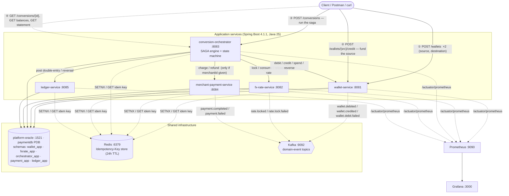
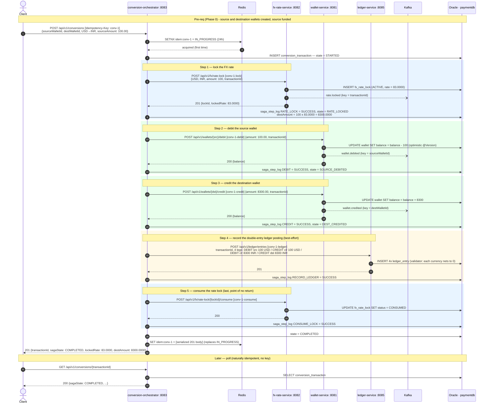
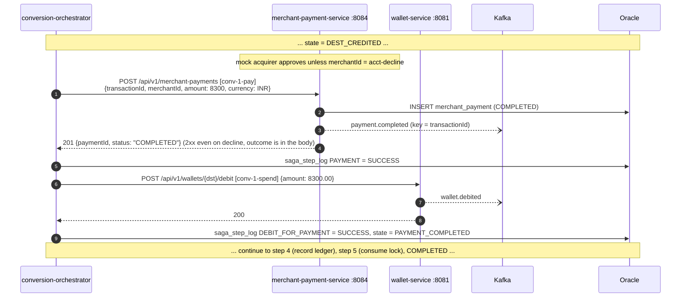
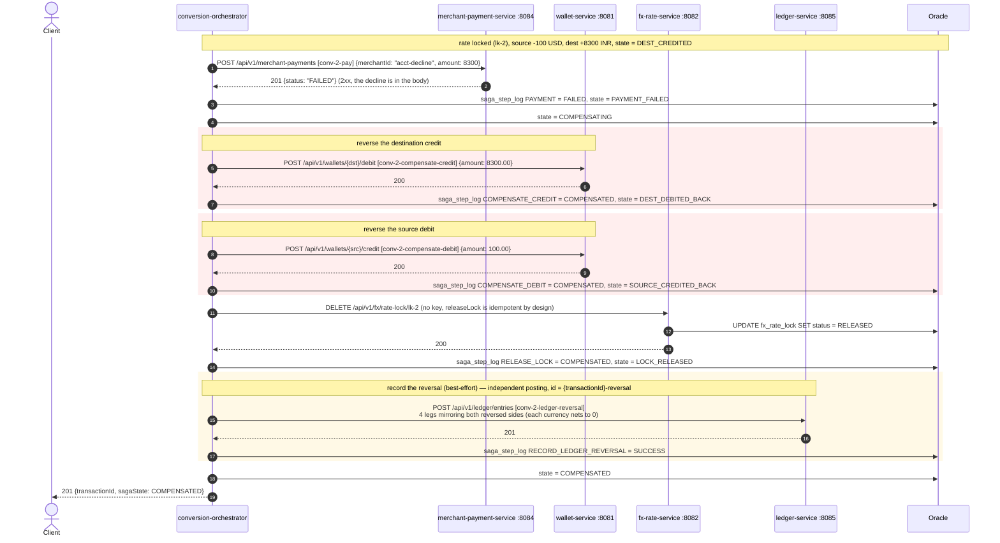
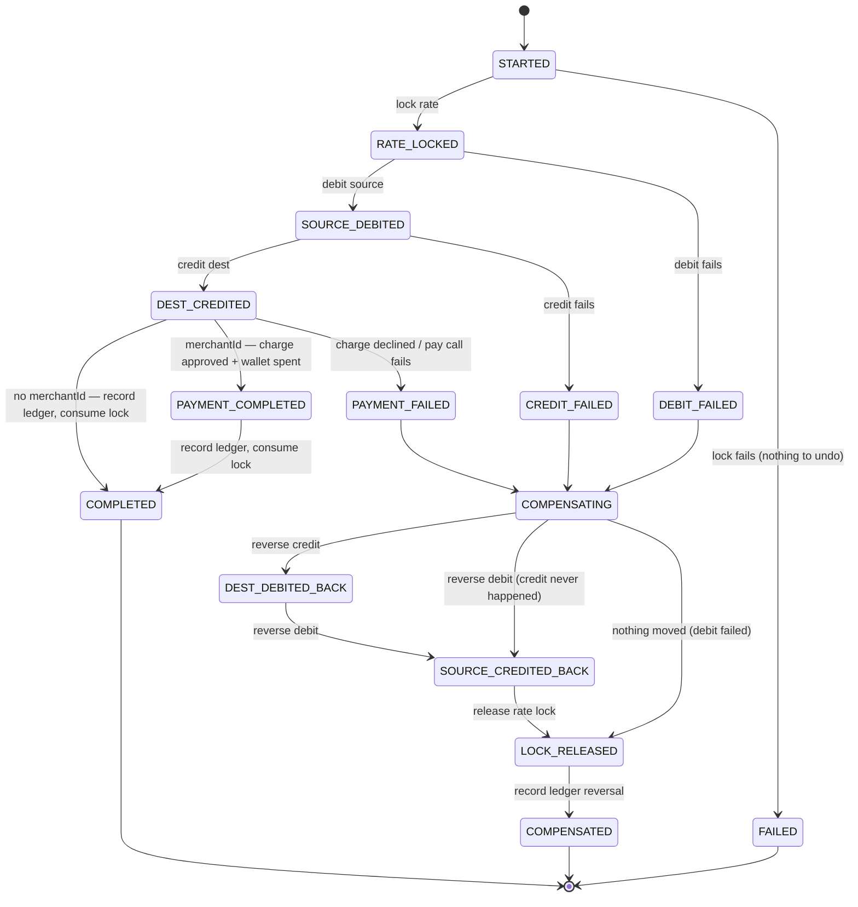

# End-to-End Flow — From Creating a Wallet to a Recorded Transaction

How the five services work together for one complete money movement: create the wallets, run a
wallet-to-wallet currency conversion (optionally paying a merchant with the result), and record
the whole thing in the double-entry ledger and the saga log.

The "transaction" here is the **conversion SAGA** driven by `conversion-orchestrator` (design
doc §5.3). It calls the other services' REST APIs synchronously, in order, inside one request;
every downstream write carries its own `Idempotency-Key` and publishes a Kafka event. On any
failure it runs compensation to put every balance back.

> **Scope note.** The orchestrator uses **synchronous REST calls**, not async Kafka
> choreography — the services still publish their events (`wallet.*`, `rate.*`, `payment.*`) but
> nothing consumes them yet. See conversion-orchestrator-implementation.md for the deferred
> async design and the three real bugs found building this.

Related: [`README.md`](../README.md) · design doc §5.3 / §6.6 ·
[`idempotency.md`](idempotency.md) · [`kafka-events.md`](kafka-events.md) ·
[`oracle-migration.md`](oracle-migration.md) · each `*-implementation.md`.

---

## Block diagram



Each service owns one Oracle **schema** in the single shared instance (they connect as their own
user). Redis and Kafka are platform-wide, namespaced/keyed per service.

---

## The complete flow, phase by phase

Worked example: user converts **100.00 USD → INR** at a locked rate of **83.0000**, so
`destAmount = 100.0000 × 83.0000 = 8300.0000 INR`.

### Phase 0 — Provision the wallets  (client → wallet-service)

| # | Call | Notes |
|---|---|---|
| 1a | `POST :8081/api/v1/wallets` `{userId, currency:"USD", highContention:false}` — header `Idempotency-Key: w-src-1` | creates the **source** wallet, `balance = 0`, `status = ACTIVE` |
| 1b | same, `currency:"INR"`, `Idempotency-Key: w-dst-1` | creates the **destination** wallet |
| 2 | `POST :8081/api/v1/wallets/{sourceWalletId}/credit` `{amount:500.00, transactionId:"seed-1"}` — `Idempotency-Key: fund-src-1` | funds the source so the conversion's debit can succeed |

`(userId, currency)` is `UNIQUE`, so a retried create returns a clean replay via the
Idempotency-Key rather than a 409. Balances are `NUMBER(18,4)`.

### Phase 1 — Start the conversion  (client → conversion-orchestrator)

```
POST :8083/api/v1/conversions
Idempotency-Key: conv-1
{ "userId":"user-1",
  "sourceWalletId": "<src>", "destWalletId": "<dst>",
  "sourceCurrency":"USD", "destCurrency":"INR",
  "sourceAmount": 100.00
  /* optional: "merchantId": "merchant-abc"  → also pay a merchant with the result */ }
```

`ConversionController` wraps the **entire** saga in `idempotencyGuard.runIdempotent("conv-1", …)`:

1. `SETNX idem:conv-1 = IN_PROGRESS` (Redis, 24h). If the key already holds a finished
   response, that response is returned and **nothing re-runs**; if it holds `IN_PROGRESS`, the
   caller gets `409`.
2. `INSERT orchestrator_app.conversion_transaction` — new `transactionId` (UUID), `saga_state = STARTED`.

### Phase 2 — The saga (happy path, no merchant)

Each step: one synchronous REST call → persist a `saga_step_log` row → advance `saga_state`
(through `SagaStateMachine`, which rejects any out-of-order move) → save `conversion_transaction`.

| Step | Call (with its own Idempotency-Key) | State after | Kafka |
|---|---|---|---|
| **1. Lock rate** | `POST :8082/api/v1/fx/rate-lock` `{USD, INR, amount:100, transactionId}` · `conv-1-lock` → `{lockId, lockedRate:83.0000}`. Orchestrator computes `destAmount = 8300.0000`. | `RATE_LOCKED` | `rate.locked` (key `transactionId`) |
| **2. Debit source** | `POST :8081/api/v1/wallets/{src}/debit` `{amount:100.00, transactionId}` · `conv-1-debit`. Wallet applies it under optimistic locking (`@Version`) — or `SELECT … FOR UPDATE` if `highContention`. | `SOURCE_DEBITED` | `wallet.debited` (key `walletId`) |
| **3. Credit destination** | `POST :8081/api/v1/wallets/{dst}/credit` `{amount:8300.00, transactionId}` · `conv-1-credit` | `DEST_CREDITED` | `wallet.credited` |
| **4. Record ledger** *(best-effort)* | `POST :8085/api/v1/ledger/entries` · `conv-1-ledger` — the 4-leg posting below. A failure here is logged, `saga_step_log RECORD_LEDGER=FAILED`, and the saga still completes (the money already moved correctly). | unchanged | — |
| **5. Consume lock** *(best-effort, point of no return)* | `POST :8082/api/v1/fx/rate-lock/{lockId}/consume` · `conv-1-consume`. Done **last**, only once no step can still trigger compensation — a `CONSUMED` lock can't be released. | unchanged | — |
| **6. Complete** | — | `COMPLETED` | — |

Then: `SET idem:conv-1 = <serialized 201 body>` (replaces `IN_PROGRESS`), respond `201`.

### Phase 2b — The saga with a merchant charge (`merchantId` present)

Inserted **between step 3 (`DEST_CREDITED`) and step 4**:

| Step | Call | State after |
|---|---|---|
| Charge acquirer | `POST :8084/api/v1/merchant-payments` `{transactionId, merchantId, amount:8300, currency:INR}` · `conv-1-pay`. **Always returns `2xx`** — a decline is `{status:"FAILED"}` in the body, read by the client, not an exception. Approved → `payment.completed`; declined → `payment.failed`. | (see below) |
| Spend the credited funds | on **approved**: `POST :8081/api/v1/wallets/{dst}/debit` `{amount:8300.00, transactionId}` · `conv-1-spend` — the converted money passes through to the merchant, net effect on the destination wallet is zero. | `PAYMENT_COMPLETED` |

On **decline** (or the pay call throwing): `PAYMENT_FAILED` → full compensation (Phase 3b). If
the charge is approved but the spend-debit fails, the orchestrator **refunds the acquirer first**
(`POST /merchant-payments/{paymentId}/refund`), then compensates.

### Phase 3 — What gets recorded (happy path)

**Ledger — one balanced double-entry posting** (`ledger_app.ledger_entry`, append-only). Because
the two wallet legs are in different currencies and can't net against each other, a synthetic
**FX clearing account** (`SYSTEM-FX-CLEARING`) absorbs the conversion so *each currency group
nets to zero on its own*:

| walletId | type | amount | currency | balanceAfter |
|---|---|---|---|---|
| `<src>` | DEBIT | 100.0000 | USD | *source balance after step 2* |
| `SYSTEM-FX-CLEARING` | CREDIT | 100.0000 | USD | 0 |
| `SYSTEM-FX-CLEARING` | DEBIT | 8300.0000 | INR | 0 |
| `<dst>` | CREDIT | 8300.0000 | INR | *dest balance after step 3* |

`transactionId` on all four legs = the saga's `transactionId`. A second `POST` for that
`transactionId` is rejected (`LEDGER_CONFLICT`) — corrections are new offsetting postings, never
mutations. *(The merchant-charge "spend" debit is not ledgered yet — a deliberate follow-up.)*

**Saga log** — `orchestrator_app.saga_step_log`, one row per step attempt: `step_name`,
`status` (`SUCCESS` / `FAILED` / `COMPENSATED`), `payload` (a short summary, or the downstream
`HTTP nnn – {body}` on failure).

**Conversion row** — `orchestrator_app.conversion_transaction` updated in place through the saga:
final `saga_state`, `locked_rate`, `fx_lock_id`, `dest_amount`, timestamps.

**Redis** — `orchestrator:idem:conv-1` now holds the serialized `201` response (24h). Each
downstream service also cached its own step under `wallet:idem:conv-1-debit`,
`fxrate:idem:conv-1-lock`, etc.

**Kafka** — `rate.locked`, `wallet.debited`, `wallet.credited` (and `payment.completed` if a
merchant was paid) were published fire-and-forget. No consumer yet.

### Phase 4 — Observe the result

```
GET  :8083/api/v1/conversions/{transactionId}      → { sagaState:"COMPLETED", lockedRate, destAmount, ... }
GET  :8081/api/v1/wallets/{dst}/balance            → 8300.0000  (or 0 if a merchant was paid)
GET  :8085/api/v1/ledger/wallets/{dst}/statement   → the CREDIT leg above
```

---

## UML sequence diagram — happy path (wallet-to-wallet, no merchant)



### Delta for a merchant charge

Between step 3 and step 4:



---

## UML sequence diagram — failure & compensation (declined merchant charge)

Rate is locked, source debited, destination credited — then the acquirer declines. Compensation
unwinds **both** wallet legs, releases the (never-consumed) lock, and records a reversal posting.



**Which sides get reversed** depends on where it failed:

| Failure point | State | Reverse credit? | Reverse debit? | Reversal legs posted |
|---|---|---|---|---|
| Rate lock | `FAILED` | — | — | none (nothing moved, saga just ends) |
| Debit source | `DEBIT_FAILED` | no | no | none — only the lock is released |
| Credit dest | `CREDIT_FAILED` | no | yes | 2 (source side) |
| Merchant charge declined / pay call fails | `PAYMENT_FAILED` | yes | yes | 4 (both sides) |

If a compensation step *itself* fails (e.g. `wallet-service` unreachable), the saga stops at
`COMPENSATING` / `DEST_DEBITED_BACK` / `SOURCE_CREDITED_BACK` / `LOCK_RELEASED` — logged at
`ERROR`, **not** auto-retried, and never falsely marked `COMPENSATED`.

---

## Saga state machine



`SagaStateMachine.transition(current, next)` is pure logic over an
`EnumMap<SagaState, Set<SagaState>>`; any move not drawn above is rejected, so a duplicate or
out-of-order call can't corrupt saga state.

---

## Idempotency-Key per step

Client sends one key on `POST /conversions` (e.g. `conv-1`). The orchestrator derives a distinct
key per downstream write — each is a separate HTTP request needing its own safe-retry identity
in the target service's Redis.

| Saga step | Idempotency-Key | Target |
|---|---|---|
| start conversion (wraps the whole saga) | `conv-1` (client-supplied) | orchestrator `POST /api/v1/conversions` |
| lock rate | `conv-1-lock` | fx `POST /api/v1/fx/rate-lock` |
| debit source | `conv-1-debit` | wallet `POST /api/v1/wallets/{src}/debit` |
| credit destination | `conv-1-credit` | wallet `POST /api/v1/wallets/{dst}/credit` |
| charge merchant | `conv-1-pay` | merchant `POST /api/v1/merchant-payments` |
| spend (fund the charge) | `conv-1-spend` | wallet `POST /api/v1/wallets/{dst}/debit` |
| record ledger | `conv-1-ledger` | ledger `POST /api/v1/ledger/entries` |
| consume lock | `conv-1-consume` | fx `POST /api/v1/fx/rate-lock/{id}/consume` |
| compensate credit | `conv-1-compensate-credit` | wallet `POST /api/v1/wallets/{dst}/debit` |
| compensate debit | `conv-1-compensate-debit` | wallet `POST /api/v1/wallets/{src}/credit` |
| record ledger reversal | `conv-1-ledger-reversal` | ledger `POST /api/v1/ledger/entries` (id `{txn}-reversal`) |
| release lock | *(none — idempotent by design)* | fx `DELETE /api/v1/fx/rate-lock/{id}` |
| refund | *(none — idempotent by design)* | merchant `POST /api/v1/merchant-payments/{id}/refund` |

See [`idempotency.md`](idempotency.md) for the `SETNX` mechanics and the "only success is
cached" rule.

---

## What gets recorded, and where

| Store | Location | Written | Contents |
|---|---|---|---|
| Oracle | `orchestrator_app.conversion_transaction` | 1 row/saga, updated in place | userId, wallet ids, currencies, `source_amount`, `dest_amount`, `locked_rate`, `fx_lock_id`, `saga_state`, `idempotency_key` (UNIQUE), timestamps |
| Oracle | `orchestrator_app.saga_step_log` | 1 row per step attempt | `step_name`, `status` (SUCCESS/FAILED/COMPENSATED), `payload` (CLOB — summary or `HTTP nnn – {body}`) |
| Oracle | `wallet_app.wallet` | balance mutated per debit/credit | optimistic (`@Version`) or pessimistic (`SELECT … FOR UPDATE`) locking |
| Oracle | `fxrate_app.fx_rate_lock` | 1 row/lock | `locked_rate`, `status`: `ACTIVE → CONSUMED` (completed) or `RELEASED`/`EXPIRED` |
| Oracle | `payment_app.merchant_payment` | 1 row/charge | `status`: `PENDING → COMPLETED`/`FAILED`/`REFUNDED`, `acquirer_ref` |
| Oracle | `ledger_app.ledger_entry` | 4 rows/completed conversion; 2 or 4 on compensation | append-only double-entry legs incl. the FX clearing-account legs |
| Redis | `<svc>:idem:<key>` | per write | cached response or `IN_PROGRESS`, 24h TTL |
| Kafka | `wallet.*`, `rate.*`, `payment.*` | per write | fire-and-forget events; no consumer yet |

---

## Run it end to end (curl)

```bash
W=http://localhost:8081 ; ORC=http://localhost:8083 ; L=http://localhost:8085

# Phase 0 — two wallets, fund the source
SRC=$(curl -s -XPOST $W/api/v1/wallets -H 'Content-Type: application/json' \
  -H 'Idempotency-Key: w-src-1' \
  -d '{"userId":"user-1","currency":"USD","highContention":false}' | jq -r .walletId)
DST=$(curl -s -XPOST $W/api/v1/wallets -H 'Content-Type: application/json' \
  -H 'Idempotency-Key: w-dst-1' \
  -d '{"userId":"user-1","currency":"INR","highContention":false}' | jq -r .walletId)
curl -s -XPOST $W/api/v1/wallets/$SRC/credit -H 'Content-Type: application/json' \
  -H 'Idempotency-Key: fund-src-1' -d '{"amount":500.00,"transactionId":"seed-1"}' | jq

# Phase 1+2 — run the saga (add "merchantId":"merchant-abc" to also pay a merchant;
#                          use "acct-decline" to force compensation)
TXN=$(curl -s -XPOST $ORC/api/v1/conversions -H 'Content-Type: application/json' \
  -H 'Idempotency-Key: conv-1' \
  -d "{\"userId\":\"user-1\",\"sourceWalletId\":\"$SRC\",\"destWalletId\":\"$DST\",\
\"sourceCurrency\":\"USD\",\"destCurrency\":\"INR\",\"sourceAmount\":100.00}" | tee /dev/stderr | jq -r .transactionId)

# Phase 4 — observe
curl -s $ORC/api/v1/conversions/$TXN | jq          # sagaState: COMPLETED, lockedRate, destAmount
curl -s $W/api/v1/wallets/$DST/balance | jq        # 8300.0000  (0 if a merchant was paid)
curl -s $L/api/v1/ledger/wallets/$DST/statement | jq

# Idempotency — resend Phase 1 with the SAME key: identical body, saga does not re-run
curl -s -XPOST $ORC/api/v1/conversions -H 'Content-Type: application/json' \
  -H 'Idempotency-Key: conv-1' \
  -d "{\"userId\":\"user-1\",\"sourceWalletId\":\"$SRC\",\"destWalletId\":\"$DST\",\
\"sourceCurrency\":\"USD\",\"destCurrency\":\"INR\",\"sourceAmount\":100.00}" | jq
```

The stack must be up first — `cd backend && docker compose up -d` (see
[`README.md`](../README.md) → "How to run it locally"). The combined Postman collection
(`distributed-payment-platform.postman_collection.json`) has all of these requests wired with
variable capture.
